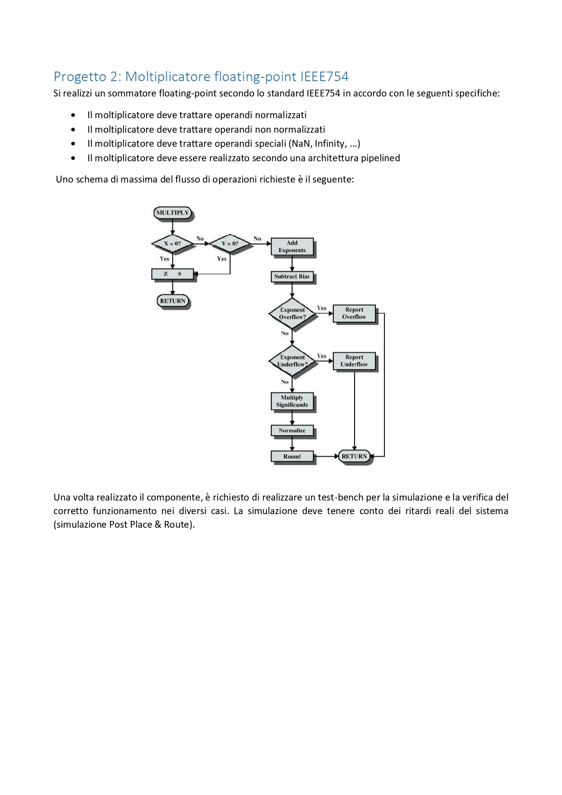

# Logic Networks final test Polimi - ENG

In this project, developed in collaboration with [Luca Zani](https://github.com/zaniluca), we created a floating-point multiplier compliant with the IEEE754 standard using Xilinx ISE. The project can also handle denormalized numbers and was presented as the final exam for the "Logic Networks" course at the Politecnico di Milano, Cremona campus. (Final grade: 30/30)

## Execution Instructions

1. Clone this repository.
2. Download Xilinx ISE, obtain a (free) license, and create a new project.
3. Copy and paste all the .vhd code into the new components, using the same names as the original files (a tedious but necessary operation due to the obsolescence of Xilinx ISE).
4. Make sure to also copy the test benches (TB).
5. Run the simulation in Post Place&Route mode.

# Prova finale di Reti Logiche - ITA

In questo progetto, realizzato in collaborazione con [Luca Zani](https://github.com/zaniluca), abbiamo sviluppato un moltiplicatore floating point conforme allo standard IEEE754 utilizzando Xilinx ISE. Il progetto è in grado di gestire anche numeri denormalizzati ed è stato presentato come prova finale del corso "Reti Logiche" presso il Politecnico di Milano, sede di Cremona. (Voto finale: 30/30)

## Istruzioni per l'esecuzione

1. Clonare questo repository.
2. Scaricare Xilinx ISE, ottenere una licenza (gratuita) e creare un nuovo progetto.
3. Copiare e incollare tutto il codice .vhd nei nuovi componenti, utilizzando gli stessi nomi dei file originali (operazione tediosa ma necessaria data l'obsolescenza di Xilinx ISE).
4. Assicurarsi di copiare anche i test bench (TB).
5. Eseguire la simulazione in modalità Post Place&Route.
